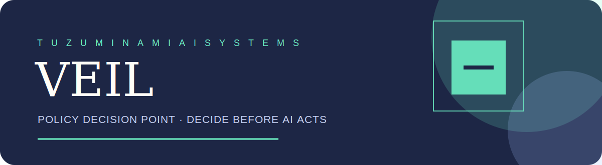
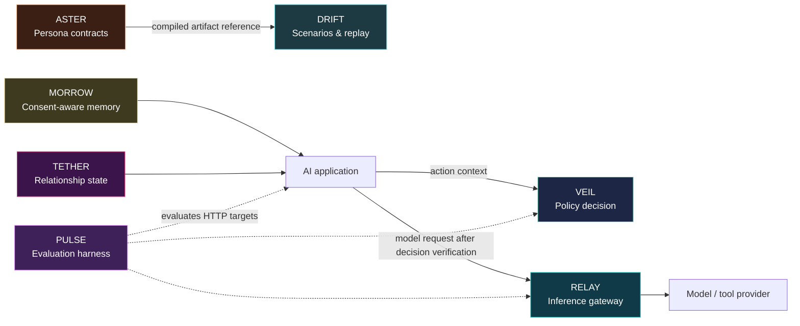

# VEIL
<p align="center">
  
</p>

<p align="center"><strong>Part of the Tuzuminami AI Systems reference architecture.</strong><br />Independent packages, designed to compose — without claiming runtime package dependencies.</p>

> **System role:** Decide before AI acts. VEIL is the fail-closed policy decision point for agent model and tool execution.

## Ecosystem reference architecture

The map below describes an **intended composition**, not current npm/package dependencies. Every repository remains independently usable and independently versioned. An application verifies a VEIL decision before it invokes RELAY; this does not indicate direct VEIL-to-RELAY SDK integration.



| System | What it contributes |
| --- | --- |
| [VEIL](https://github.com/tuzuminami/veil) | Fail-closed policy decisions and receipts before agent actions. |
| [TETHER](https://github.com/tuzuminami/tether) | Explicit, explainable relationship state. |
| [RELAY](https://github.com/tuzuminami/relay) | Tenant-aware inference routing and provider enforcement. |
| [PULSE](https://github.com/tuzuminami/pulse) | Regression evaluation for HTTP targets and release evidence. |
| [MORROW](https://github.com/tuzuminami/morrow) | Consent, purpose, retention, and revocation-aware memory. |
| [DRIFT](https://github.com/tuzuminami/drift) | Deterministic scenario/session orchestration and replay. |
| [ASTER](https://github.com/tuzuminami/aster) | Versioned persona contracts compiled into portable artifacts. |


VEIL is a fail-closed policy decision point for AI agent model calls and tool execution. It evaluates versioned tenant policies before an action runs and returns an auditable, tamper-evident decision receipt.

## v1.0 Capabilities

- Typed `model_call` and `tool_call` pre-execution decisions.
- `ALLOW`, `REQUIRE_CONFIRMATION`, `BLOCK`, and `ESCALATE` enforcement outcomes.
- Immutable policy versions with active binding and rollback.
- Rules for agent, tool/resource, data classification, model, attributes, and numeric cost ceilings.
- OpenID AuthZEN Authorization API 1.0-compatible JSON single-evaluation endpoint.
- OIDC/JWT verification with remote JWKS, issuer, audience, algorithm, tenant, and scope checks.
- Short-lived Ed25519 enforcement tokens for `ALLOW` decisions, with public-key rotation through `/.well-known/jwks.json`.
- PostgreSQL persistence with tenant-scoped queries and atomic decision, receipt, audit, outbox, and idempotency writes.
- OpenAPI 3.1, JSON Schemas, JavaScript SDK, package install smoke tests, dependency audit, and release SBOM.

VEIL defaults to `BLOCK` or `ESCALATE`. Missing policy state, ambiguous adapter output, authentication failure, tenant mismatch, persistence failure, or malformed input never becomes `ALLOW`.

## Requirements

- Node.js 22 or newer.
- pnpm 10 for repository development.
- PostgreSQL 16 or newer for production operation.
- HTTPS at the service or trusted reverse-proxy boundary.

## Local Evaluation

```bash
pnpm install --frozen-lockfile
pnpm run verify
node src/server.js
```

The local server uses a file store and development bearer token:

```text
Authorization: Bearer dev:<tenant-id>:<actor-id>:<comma-separated-scopes>
X-Tenant-Id: <tenant-id>
```

The development runtime is disabled when `NODE_ENV=production`.

## Production Runtime

Run the checksummed migration runner, then configure PostgreSQL plus an OIDC issuer:

```bash
DATABASE_URL='postgresql://veil@db/veil' pnpm run migrate

NODE_ENV=production \
DATABASE_URL='postgresql://veil@db/veil' \
VEIL_OIDC_ISSUER='https://identity.example.com/' \
VEIL_OIDC_AUDIENCE='veil-api' \
VEIL_OIDC_JWKS_URL='https://identity.example.com/.well-known/jwks.json' \
VEIL_AUTHZEN_POLICY_ID='agent-baseline' \
VEIL_ENFORCEMENT_PRIVATE_KEY="$VEIL_ENFORCEMENT_PRIVATE_KEY" \
VEIL_ENFORCEMENT_KEY_ID='veil-2026-01' \
VEIL_ENFORCEMENT_ISSUER='https://veil.example.com' \
node src/server.js
```

The verified JWT `tenant_id` claim is authoritative. `X-Tenant-Id` is optional requested context and is rejected when it conflicts with the verified claim. See [production operations](./docs/runbooks/production.md) for all settings, TLS, migration, backup, and rollback guidance.

## RELAY Enforcement Tokens

Production VEIL signs only `ALLOW` decisions as compact Ed25519 JWS tokens. The token binds `iss`, `aud`, `tenant_id`, `action`, `decision_id`, `jti`, `input_hash`, `policy_hash`, `receipt_hash`, `iat`, and `exp`; its lifetime is 60 seconds by default and can be reduced with `VEIL_ENFORCEMENT_TTL_SECONDS` (maximum 300 seconds). RELAY and other PEPs must fetch `/.well-known/jwks.json`, select the public key by `kid`, verify `EdDSA`, issuer, audience, expiry, tenant, action, and request input hash before I/O. On an unknown key, refresh the JWK Set once; any verification failure is a fail-closed denial. Rotate by publishing a new deployment with the new key and retaining the previous public key until all outstanding tokens have expired.

`input_hash` uses the public `veil-input-hash/1` contract: `computeDecisionInputHash(decisionRequest)` canonicalizes the exact VEIL decision request (including typed agent/resource/model fields when present) and returns lowercase SHA-256 hex. A PEP must retain the decision request it sent to VEIL and recompute this value before provider I/O; never hash an unrelated transport body.

An idempotent retry returns the original decision artifact and never reissues a token. If that token has expired, submit a new decision request with a new idempotency key so VEIL can evaluate current policy and issue a new token.

When running migrations from the published package rather than a repository checkout, install `@tuzuminami/veil` and use `DATABASE_URL='postgresql://veil@db/veil' pnpm exec veil-migrate`.

## Policy Example

[examples/ai-agent-policy.json](./examples/ai-agent-policy.json) blocks restricted data, blocks actions over a cost ceiling, requires confirmation for tool calls, and allows known model calls. Create, publish, and bind it before evaluating requests.

```bash
curl -s https://veil.example.com/v1/policies \
  -H "Authorization: Bearer $TOKEN" \
  -H 'Content-Type: application/json' \
  --data-binary @- <<'JSON'
{
  "policyId": "agent-baseline",
  "bundle": {
    "name": "agent-baseline",
    "version": "1.0.0",
    "defaultAction": "BLOCK",
    "rules": [{
      "id": "allow-approved-model",
      "priority": 10,
      "effect": "ALLOW",
      "match": { "field": "model.id", "operator": "equals", "value": "approved-model" },
      "reasonCode": "APPROVED_MODEL"
    }]
  }
}
JSON
```

## AuthZEN Single Evaluation

VEIL implements the AuthZEN Authorization API 1.0 JSON contract for single access evaluations at `POST /access/v1/evaluation`. It does not claim support for the complete AuthZEN API family or conformance certification.

```bash
curl -s https://veil.example.com/access/v1/evaluation \
  -H "Authorization: Bearer $TOKEN" \
  -H 'Content-Type: application/json' \
  -H 'X-Request-ID: eval-123' \
  -d '{
    "subject": { "type": "agent", "id": "agent-1" },
    "action": { "name": "model_call" },
    "resource": {
      "type": "dataset",
      "id": "public-docs",
      "properties": { "classification": "public" }
    },
    "context": {
      "model": { "provider": "openai", "id": "approved-model" },
      "estimatedCost": 0.10
    }
  }'
```

An authorization denial is HTTP 200 with `{"decision":false}`. VEIL includes its detailed action, reason codes, obligations, and receipt under the optional response `context`. Deploy this endpoint over HTTPS; the bundled Node server can sit behind a trusted TLS reverse proxy.

## Decision Receipts

Every decision includes policy and input hashes plus a canonical receipt hash. Consumers can verify accidental or unauthorized mutation:

```js
import { verifyDecisionReceipt } from "@tuzuminami/veil";

if (!verifyDecisionReceipt(decision.receipt)) {
  throw new Error("VEIL receipt integrity check failed");
}
```

The receipt hash is tamper-evident, not a digital signature. Downstream systems that require non-repudiation should sign or externally anchor the receipt hash.

## Public API

```js
import {
  PostgresVeilStore,
  VeilService,
  buildServer,
  createOidcAuthenticator,
  createProductionServer,
  verifyDecisionReceipt
} from "@tuzuminami/veil";
```

The JavaScript client is exported from `@tuzuminami/veil/sdk`. OIDC, PostgreSQL, and migration runner APIs are also available as `@tuzuminami/veil/auth`, `@tuzuminami/veil/postgres`, and `@tuzuminami/veil/migrations`.

## Security Model

- Authentication, tenant, and scope decisions are made from verified claims.
- Typed decision context is accepted only from credentials with both `decision:write` and the trusted-PEP `decision:context:assert` scope.
- All PostgreSQL resource reads and writes include tenant predicates or tenant-keyed constraints.
- Decision persistence, audit, outbox, and idempotency records commit atomically.
- Request bodies are bounded and JSON-only.
- Raw policy inputs are hashed rather than copied into audit events.
- Production readiness reflects persistence availability.

Review [SECURITY.md](./SECURITY.md) before deployment. Report vulnerabilities privately rather than opening a public exploit issue.

## Scope

VEIL v1.0 is a self-hosted pre-execution PDP. It is not an identity provider, chat UI, policy GUI, billing system, legal certification, or general moderation platform. Dynamic plugin loading, policy replay, shadow evaluation, multi-region control planes, and transformation execution are deferred.

## Development

```bash
pnpm run build
pnpm run test
pnpm run audit
pnpm run check:private-boundary
pnpm run check:package
pnpm run check:release
pnpm run verify
```

Release procedure: [docs/runbooks/release.md](./docs/runbooks/release.md).

## License

Apache-2.0. See [LICENSE](./LICENSE).
